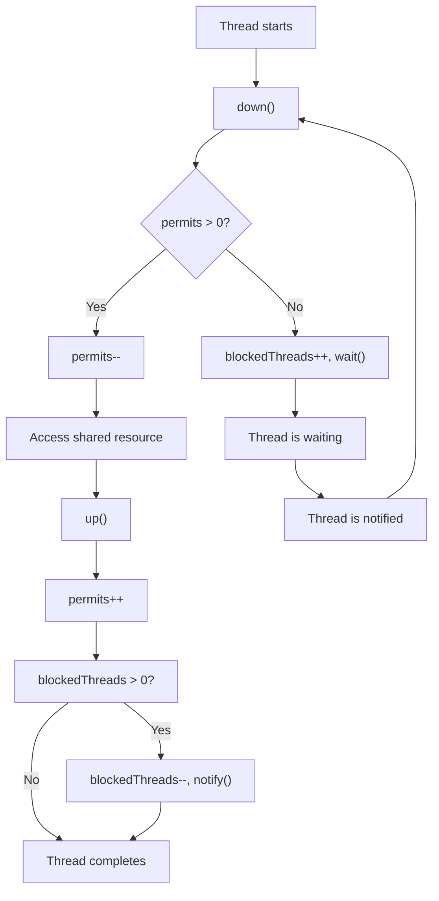

<h1 align="center">TP1-2 · Synchronization and Parallel Programming</h1>
<h4 align="center">Mael KERICHARD - Fabien GOARDOU</h4>
<p align="center">
   
   
   
</p>

# Exercice 1

## 🤨 Instructions

Exercise 1:
The goal of this exercise is to implement an extended semaphore using Java monitors.
Your semaphore should implement the following interface (available in the lab's resources):
```java
public interface SemaphoreInterface {
public void up();
public void down();
public int  releaseAll();
} // EndInterface SemaphoreInterface
```
`up()` and `down()` correspond to the traditional semaphore operations. `releaseAll()` is an extension that unblocks all threads waiting on the semaphore, and returns the number of threads that have just been unblocked.
In addition to the above interface, your implementation should provide a constructor that takes no parameters, and returns a semaphore that contains zero permits.

## 💡 Explanation

### Instance Variables

```java
private int permits;
private int blockedThreads;
```

There are two instance variables:

1. `permits`: The number of available permits. When a thread acquires a permit, it can access the shared resource.
2. `blockedThreads`: The number of threads currently blocked, waiting for a permit.

### Constructor

```java
public Semaphore() {
    this.permits = 0;
    this.blockedThreads = 0;
}
```
The constructor initializes both instance variables to 0, meaning there are no permits available, and no threads are blocked.

### `up()`

```java
public synchronized void up() {
    permits++;
    if (blockedThreads > 0) {
        blockedThreads--;
        this.notify();
    }
}
```
The `up()` method increases the number of available permits by 1. If there are blocked threads, it decreases the blocked threads count by 1 and wakes up one of the blocked threads using this.notify().

### down() Method

```java
public synchronized void down() {
    while (permits == 0) {
        try {
            blockedThreads++;
            this.wait();
        } catch (InterruptedException e) {
            // Handle the exception or rethrow it as needed
            Thread.currentThread().interrupt();
        }
    }
    permits--;
}
```

The `down()` method attempts to acquire a permit. If there are no permits available, the current thread is blocked and added to the blocked threads count. The thread then waits using `this.wait()` until it is woken up by another thread calling the `up()` method. If the thread is interrupted while waiting, it re-interrupts itself. Once a permit is available, it is acquired by decrementing the `permits` variable.

### releaseAll() Method

```java
public synchronized int releaseAll() {
    int blockedThreads = this.blockedThreads;
    this.blockedThreads = 0;
    this.permits += blockedThreads;
    this.notifyAll();

    return blockedThreads;
}
```

The `releaseAll()` method releases all blocked threads by setting the `blockedThreads` count to 0 and increasing the number of permits by the original number of blocked threads. It then wakes up all waiting threads using `this.notifyAll()`. The method returns the number of released threads.

### Example Usage

Consider a scenario where we have a shared resource that can only be accessed by a limited number of threads at a time. We can use the `Semaphore` class to control access to the shared resource.

```java
Semaphore semaphore = new Semaphore(); // Create a new semaphore instance
Thread t1 = new Thread(() -> {
    semaphore.down(); // Acquire a permit
    // Access the shared resource
    semaphore.up(); // Release the permit
});

Thread t2 = new Thread(() -> {
    semaphore.down(); // Acquire a permit
    // Access the shared resource
    semaphore.up(); // Release the permit
});

t1.start();
t2.start();
```

In this example, two threads (`t1` and `t2`) try to access the shared resource. The semaphore ensures that only one thread can access the resource at a time. If there are no permits available, the other thread will be blocked until the

current thread releases the permit by calling `up()`. Once a permit is released, the blocked thread can acquire it and proceed to access the shared resource.

### Mermaid Graph

Here is a mermaid graph illustrating the flow of the Semaphore's methods and how they interact with each other:



The graph shows the flow of a thread as it interacts with the Semaphore. When a thread starts, it calls the `down()` method to acquire a permit. If there are permits available, it decrements the permits and proceeds to access the shared resource. After accessing the resource, the thread calls the `up()` method to release the permit, incrementing the permits count. If there are blocked threads, the method decreases the blocked threads count and notifies a waiting thread.

If there are no permits available when a thread calls the `down()` method, the thread is blocked, and the blocked threads count is incremented. The thread then waits for a notification. When a waiting thread is notified, it attempts to acquire a permit again by calling the `down()` method. This cycle continues until the thread acquires a permit and accesses the shared resource.

# Exercise 2

## 🤨 Instructions

The goal of this exercise is to learn to use the rendez-vous mechanism provided by Java.
Rendez-vous synchronisation is provided in Java by the Exchanger<V> class. We will use this class to implement a small
ping-pong program in which two threads (called "Alice" and "Bob") repeatedly exchange two string objects ("Ping" and "
Pong").
First, read the documentation for this class
at http://docs.oracle.com/javase/7/docs/api/java/util/concurrent/Exchanger.html.
Then implement a small multithreaded program so that:

- The main program launches two threads called "Alice" and "Bob" (add a field "name" to your Thread or Runnable class
  to store this name);
- "Alice" and "Bob" both hold a reference to a string. "Alice" starts with a reference to a string containing "Ping",
  and "Bob" to a string containing "Pong".
- "Alice" and "Bob" execute the following behaviour 3 times:
    - (1) print the number of the current iteration, followed by their name, followed by the content of the string to
      which they hold a reference;
    - (2) print that they are about to go to sleep;
    - (3) wait a random time between 0 and 5000 ms;
    - (4) print that they are about to use the exchanger;
    - (5) use Java's Exchanger mechanism to exchange the thread's current string with that of the other thread;

## 💡 Explanation

1. Two threads named "Alice" and "Bob" are created and launched in the `main` function. They use
   the `PingPongRunnable` class as their `Runnable` implementation, and their names are passed as arguments to the
   constructor.

2. The `PingPongRunnable` class has a constructor that accepts the `name`, `message`, `exchanger`, and `color`
   parameters. The
   `name` field stores the thread's name, and the message field stores the thread's initial message, which is "Ping" for
   Alice and "Pong" for Bob.

3. The run method in the `PingPongRunnable` class executes a loop three times, implementing the desired behavior:
    1. Printing the iteration number, name, and message content:
    ```kt
    println("Iteration: $i $colorName has $message")
    ```
    2. Printing that the thread is about to go to sleep:
    ```kt
    println("Iteration: $i $colorName going to sleep.")
    ```
    3. Waiting a random time between 0 and 5000 ms:
    ```kt
    Thread.sleep(Random.nextLong(0, 5000))
    ```
    4. Printing that the thread is about to use the exchanger:
    ```kt
    println("Iteration: $i $colorName ready to exchange.")
    ```
    5. Using the `Exchanger` mechanism to exchange the thread's current message with that of the other thread:
    ```kt
    message = exchanger.exchange(message)
    println("Iteration: $i $colorName $message exchange completed")
    ```
